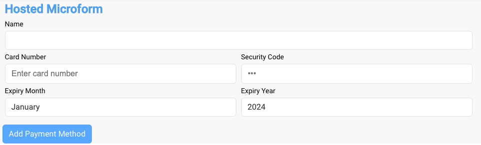

# Introduction #

Provides a "drop-in" UI for Cybersource integration.

## Development Setup #
* Clone the project

* Update the paymentServiceRoot inside /src/environments to be the root URL of the payment service API.

* Change the permission of cloned folder so that it can be accessed by angular.
```
sudo chmod -R 777 payment-service-ui
```

* Run "npm install" command in cloned repository.
```
cd payment-service-ui/
npm install
```

* Start Project on local.
```
npm run start-dev
```

## Usage

Will be contained within an IFRAME like this:
```
<iframe id="hosted-microform" frameborder="0" src="http://localhost:4222/{{bearer token}}"></iframe>
```

The bearer token will be same user token that's passed from the app, and will be used in requests to the payment service API for authentication.

If the user token was authenticated, you will see the hosted microform, otherwise an authentication error message will be displayed.



The "Add Payment Method" button will be enabled when all input fields have been entered and validated, and will post the data to the payment service API to add a payment method and on success will display the list of active payment methods.
